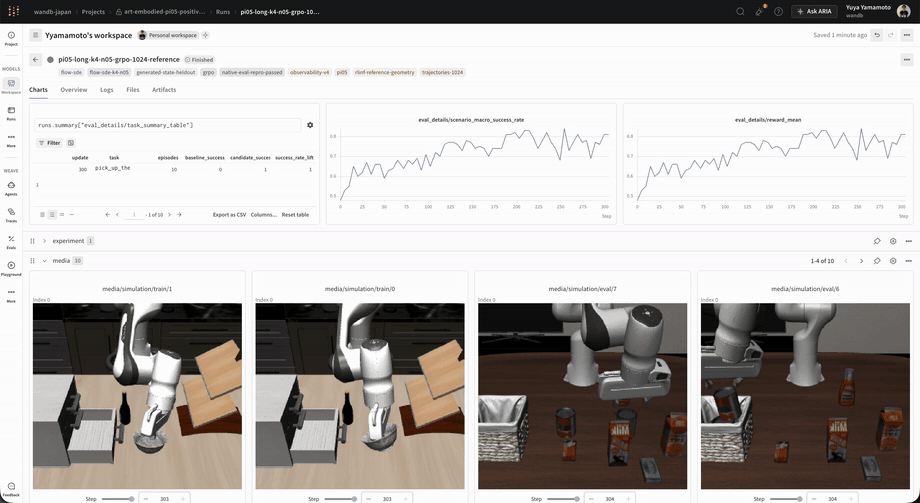

# ART-Embodied

以 [OpenPipe ART](https://github.com/OpenPipe/ART) 為基礎，為 Physical AI
提供 trajectory-aware reinforcement learning，並以
[LeRobot](https://github.com/huggingface/lerobot) 工作流程為核心設計的實驗性框架。

[English](README.md) · [日本語](README.ja.md) · [한국어](README.ko.md) ·
[简体中文](README.zh-CN.md) ·
[Embodied RL 指南](docs/experimental/embodied-rl.mdx) ·
[範例](examples/embodied/README.md) ·
[發布驗證](docs/experimental/embodied-release-validation.mdx) ·
[上游 ART 文件](https://art.openpipe.ai)

<p align="center">
  
</p>
<p align="center">
  <strong>使用 trajectory-level Flow-SDE GRPO 訓練 PI0.5 / LIBERO Long。</strong><br>
  在同一個即時實驗畫面中追蹤成功率曲線與 grouped rollout。
</p>

> [!WARNING]
> **ART-Embodied 目前處於研究預覽階段。**
>
> - **OpenVLA-OFT / GRPO：** 已在 LIBERO 驗證軌跡收集、分散式 LoRA 訓練、檢查點還原與評估。
> - **OpenVLA-OFT / GSPO：** 已驗證分散式執行與檢查點；目標函式驗證及學習效果比較仍在進行。
> - **PI0、PI0.5、SmolVLA / Flow-SDE GRPO：** 固定開發集上的成功率有所提升，多組隨機種子與封存測試（sealed test）驗證尚未完成。
> - **GR00T N1.7 / Flow-SDE GRPO：** 已完成 RoboCasa 單一任務訓練及 192 回合的封存測試。
> - **PI0-FAST / GRPO：** 已完成 LIBERO Long 單一任務訓練，開發評估與封存測試各 100 回合。結果的不確定性與驗證範圍見下文。

## 新增了什麼

LeRobot 提供策略、前後處理器、資料集與機器人環境。
ART-Embodied 加入軌跡分組收集、GRPO/GSPO 訓練、檢查點管理，
以及評估和 W&B、Weave 記錄功能。

```text
LeRobot policy + processors + environment
                   │
                   ▼
       grouped trajectories and rewards
                   │
                   ▼
      trajectory/action-token GRPO or GSPO
                   │
                   ▼
       versioned LoRA checkpoints
                   │
                   ▼
 fixed evaluation + W&B Models + Weave
```

我們以策略在原生環境中的任務成功率衡量訓練效果。

## ART lifecycle 與 LeRobot 的責任邊界

LeRobot 負責策略、前後處理、環境與動作取樣。
ART-Embodied 使用 ART 的模型管理 API，管理軌跡分組、訓練、更新步數、
檢查點、評估與日誌。

| 功能 | API |
| --- | --- |
| 模型管理 | 繼承 `art.TrainableModel` 的 `EmbodiedTrainableModel` |
| 訓練 | `backend.train(model, trajectory_groups, learning_rate=...)` |
| 軌跡分組收集 | `trajectory_group(...)` 與 `gather_trajectory_groups(...)` |
| 結果與更新步數 | `TrainResult` 與 `get_step()` |
| 日誌 | 依模型記錄 W&B 指標、影片與 Weave 軌跡追蹤 |
| 策略執行 | LeRobot 前後處理器與動作取樣器 |

專用後端處理影像、機器人狀態、動作區塊與取樣器對應的概似值。
OpenVLA 後端獨立於 ART 的 `LocalBackend`、AOM 和 Serverless Training 執行。

可以用 LeRobot 風格的高階 API 執行完整訓練迴圈，也可以用 ART 風格的低階 API
逐步控制軌跡收集與更新。兩者共用模型註冊邏輯和訓練後端。

## 已驗證結果

在相同初始狀態下，比較 SFT 與訓練後策略的成功次數：

| Policy / suite | Objective | Update | SFT | ART-Embodied | Paired lift |
| --- | --- | ---: | ---: | ---: | ---: |
| [OpenVLA-OFT / LIBERO Object](https://wandb.ai/wandb-japan/art-embodied-openvla) | Action-token GRPO | 200 | 34/100 | **100/100** | **+66 個百分點** |
| [OpenVLA-OFT / LIBERO Spatial](https://wandb.ai/wandb-japan/art-embodied-openvla-spatial) | Action-token GRPO | 100 | 48/100 | **88/100** | **+40 個百分點** |
| [PI0 / LIBERO Spatial](https://wandb.ai/wandb-japan/art-embodied-pi0-positive-control-reference/runs/941byojx) | Flow-SDE GRPO | 100 | 63/100 | **99/100** | **+36 個百分點** |
| [PI0.5 / LIBERO Long](https://wandb.ai/wandb-japan/art-embodied-pi05-positive-control-reference/runs/t0a9mnd3) | Flow-SDE GRPO | 250（best dev） | 48/100 | **84/100** | **+36 個百分點** |
| [SmolVLA / LIBERO Long](https://wandb.ai/wandb-japan/art-embodied-smolvla-positive-control-v3/runs/s4xwc2jm) | Flow-SDE GRPO | 180（best dev） | 42/100 | **69/100** | **+27 個百分點** |
| GR00T N1.7 / RoboCasa Cuttingboard-to-Pan | Flow-SDE GRPO | 100（sealed） | 111/192 | **139/192** | **+14.6 個百分點** |
| [PI0-FAST / LIBERO Long (單一任務)](https://wandb.ai/wandb-japan/art-embodied-pi0-fast-long/runs/a1hx8rsf) | Action-token GRPO | 100 (開發評估) | 70/100 | **89/100** | **+19 個百分點** |
| [PI0-FAST / LIBERO Long (單一任務)](https://wandb.ai/wandb-japan/art-embodied-pi0-fast-long/runs/ww9b5upu) | Action-token GRPO | 100 (封存測試) | [73/100](https://wandb.ai/wandb-japan/art-embodied-pi0-fast-long/runs/r56aa76y) | **83/100** | **+10 個百分點** |

**評估條件。** 前五列使用固定的 100 個開發場景，初始狀態與訓練集分離，
任務和指令與訓練時相同。這些場景在開發期間反覆使用；多組隨機種子與封存測試
驗證尚未完成。PI0.5 和 SmolVLA 展示開發評估最好的檢查點，最終分數見下文。

GR00T 在選定檢查點後，使用開發期間未接觸的 192 個環境種子進行封存測試。
結果涵蓋 RoboCasa 的一項任務，多任務和未見任務評估尚未進行。

PI0-FAST 在 LIBERO Long 的「將兩個摩卡壺放到爐台上」任務中，使用一個訓練種子和
隔離的 MuJoCo 3.3 環境。表中兩列均評估封存測試前選定的最終更新 100 檢查點。
封存測試提升 +10 個百分點，配對 95% 信賴區間為 [0, 20] 個百分點（p=0.099），
尚未達到 5% 水準的統計顯著性。多任務與穩健性評估有待進行。
詳見[配方與完整結果](docs/experimental/pi0-fast-long-result.md)。

<details>
<summary>訓練條件與配對評估詳情</summary>

- **OpenVLA-OFT Object：** rank 32/alpha 32 LoRA，200 次更新。100 個評估初始狀態獨立於 500 個訓練狀態產生。最終 100/100 與公開的 RLinf GRPO 檢查點相同。
- **OpenVLA-OFT Spatial：** 使用相同後端，分別設定 SFT 檢查點、任務集、評估集與 W&B 專案。更新 30 時為 82/100，更新 100 時為 88/100。本次比較以 SFT 為基準。
- **PI0 / PI0.5：** 使用 K4/noise 0.5 Flow-SDE 取樣器，每次更新收集 1,024 條軌跡。PI0 到更新 130 仍維持 97--99/100。PI0.5 使用 rank 32/alpha 32 LoRA，完成 300 次更新；更新 250 時最高為 84/100，最終為 81/100。
- **SmolVLA：** 共 200 次更新，在更新 100 後擴大動作專家的轉接器範圍和 rank。更新 180 時最高為 69/100，最終更新 200 時降至 61/100。
- **GR00T N1.7：** RoboCasa GR1 `PnPCounterToCab` 的 Cuttingboard-to-Pan 任務。從依 NVIDIA 配方訓練 60k 步的固定 SFT 檢查點開始，以 rank 64/alpha 64 LoRA 連續訓練 100 次更新。用固定的 64 回合開發集選定檢查點，獨立審核後進行一次封存評估：SFT 111/192，GRPO 139/192。訓練使用 Flow-SDE，評估使用官方 ODE 取樣器，並保留官方處理器、機器人構型與正規化設定。

上方的 W&B 連結包含指標、影片、模型產物與軌跡追蹤。
重現配方和初始狀態清單位於 `examples/embodied/`。

| 比較 | 改善 / 退步回合數 | 配對 95% 信賴區間（百分點） | 精確 McNemar 檢定 p |
| --- | ---: | ---: | ---: |
| OpenVLA-OFT Object | 66 / 0 | | `2.71e-20` |
| OpenVLA-OFT Spatial | 43 / 3 | | `4.62e-10` |
| PI0 | 36 / 0 | `[+27,+46]` | `2.91e-11` |
| PI0.5 | 38 / 2 | `[+26,+46]` | `1.49e-9` |
| SmolVLA | 33 / 6 | `[+16,+38]` | `1.43e-5` |
| GR00T N1.7 | 淨改善 28 回合 | `[+5.2,+24.0]` | `0.00335` |

</details>

## 目前支援狀況

| 功能 | 狀態 |
| --- | --- |
| LeRobot / Gymnasium 軌跡收集介面 | 已實作 |
| 固定初始狀態的配對評估 | 已實作 |
| 單 GPU 與本機多 GPU LoRA 訓練 | 已實作 |
| 多個 actor 共用策略的批次推論 | 已實作 |
| 包含最佳化器和 RNG 狀態的檢查點與還原 | 已實作 |
| W&B 指標、影片、Table 和模型產物 | 已實作 |
| Weave 軌跡追蹤與影片連結 | 已實作 |

### 支援單一 GPU 的資源配置

單 GPU 執行時，將兩個裝置清單設為同一張 GPU，並使用 `per_update`。
評估、軌跡收集和訓練依序執行，訓練前釋放軌跡收集使用的模型副本。

```yaml
runtime:
  rollout_devices: [cuda:0]
  training_devices: [cuda:0]
  distributed_training: false
  rollout_execution:
    lifecycle: per_update
```

`per_update` 在每個階段結束時關閉工作程序，減少 GPU 和主機記憶體占用。
`cpu_offload` 將工作程序保留在主機 RAM 中，以減少啟動時間。
詳見 [PI0.5 單 GPU 範例](examples/embodied/pi05_libero_object_flow_sde_grpo_single_gpu.yaml)。

## 安裝

> **LIBERO 初始狀態檢查：** 相依套件檢查通過並不保證初始場景符合預期。
> MuJoCo 更新可能改變 reset 期間的物體位置（Spatial task 5 已有回報）。
> 請一併重現配方的模擬器版本與 reset 設定，並參閱不需模型的[檢查與重現指南](docs/experimental/libero-reset-health.md)。
> 檢查目前需要明確執行，不會修改既有配方或自動修正初始狀態。

### 已驗證的相容性

ART-Embodied 與 OpenPipe ART 一起安裝，套件名稱為 `art_embodied`。
`0.1.0rc2` 依執行環境支援 ART 0.5.18 和 0.5.20：

| 執行環境 | OpenPipe ART | 用途 |
| --- | --- | --- |
| Python 3.12 以上預設環境 | `0.5.20` | PI0 / PI0.5、PI0-FAST、SmolVLA 設定 |
| Python 3.11 | `0.5.18` | 既有 OpenVLA-OFT 設定（LeRobot `>=0.4.4,<0.5`） |
| GR00T N1.7 專用 Python 3.12 環境 | `0.5.18` | NVIDIA 固定相依套件的原生環境 |

以下安裝指令指定 ART 版本。NVIDIA 要求 SciPy 1.15.3，而 ART 0.5.20 要求
SciPy 1.17，因此 GR00T 安裝腳本保留 ART 0.5.18。既有 ART 0.5.18 環境仍受支援。
ART 0.5.20 已通過套件安裝、數值計算、更新與復原及 W&B 檢查；範圍請參閱
[相容性驗證報告](docs/experimental/upstream-art-compatibility.md)。
標準環境使用 `constraints/security.txt`，NVIDIA 專用環境保留獨立的版本約束。
安裝方式的差異及注意事項請參閱[相依套件設定與安全](docs/experimental/dependency-security.md)。

以 `import art` 匯入 ART，以 `import art_embodied as embodied` 匯入附加元件。

ART 0.5.18 和 ART-Embodied 均支援 Python 3.11。已驗證的 OpenVLA-OFT
設定可在同一個隔離環境中執行 ART 與策略。

請使用隔離環境。Robotics policy stack 經常固定與 ART LLM backend 不同的
Torch、Transformers 與 simulator 版本。

若要在乾淨環境中重現 add-on 的安裝順序：

```bash
git clone https://github.com/wandb/ART-Embodied.git
cd ART-Embodied
python3.11 -m venv .venv
source .venv/bin/activate
python -m pip install -c constraints/security.txt 'openpipe-art==0.5.18'
python -m pip install -c constraints/security.txt '.[libero]'
art-embodied doctor --profile libero
```

此安裝過程已在全新的 Python 3.11 環境中驗證：從安裝套件載入 OpenVLA-OFT，
完成一次 LoRA GRPO 更新，儲存轉接器與訓練狀態，並還原檢查點。

若在 checkout 中以 uv 開發：

請使用 uv 0.12.0 或更新版本。`uv sync --locked` 會覆寫相依套件限制，使用
LiteLLM 1.101.0 和 Diffusers 0.38.0。GR00T N1.7 安裝指令稿只覆寫 Diffusers，
並使用 Safetensors 0.8.0。這些設定取代上游的舊版本限制，不修改上游套件。
一般 pip 安裝不會套用這些覆寫設定。

```bash
git clone https://github.com/wandb/ART-Embodied.git
cd ART-Embodied
uv sync --python 3.11 --extra lerobot
```

若使用已驗證的 LIBERO integration：

```bash
uv sync --python 3.11 --extra libero
```

PI0/PI0.5 Flow-SDE 請使用獨立的 Python 3.12 環境，安裝
LeRobot 0.6 與 Transformers 5：

```bash
python3.12 -m venv .venv-pi
source .venv-pi/bin/activate
python -m pip install -c constraints/security.txt 'openpipe-art==0.5.20' '.[pi-libero]'
art-embodied doctor --profile pi
```

請為不同用途分別建立環境：

- `lerobot`：不含模型專用及模擬器額外相依套件的 LeRobot。
- `libero`：已驗證的 OpenVLA-OFT/LIBERO 設定，使用 Torch 2.6.0、Transformers 4.40.1、PEFT 0.11.1 和 NumPy 1.26.4。
- `pi` / `pi-libero`：LeRobot 0.6 與 PI 原生取樣器。

請勿混裝這些設定。用 `lerobot[libero,peft]` 取代 `libero` 會在 LeRobot 0.4.4 下
改變 Transformers 和 PEFT 版本，即使檢查點能正常載入，動作 logits 也可能改變。

在配置 GPU 前，請先檢查已安裝的 control-plane stack：

```bash
uv run art-embodied doctor

# 在通用 LeRobot worker profile 中使用。
uv run art-embodied doctor --require-lerobot

# 為 OpenVLA-OFT/LIBERO profile 配置 GPU 前使用。
uv run art-embodied doctor --profile libero
```

對 process-isolated policy environment 使用 `--worker`；它會驗證選定的
package profile，而不要求 worker process 中存在 ART。只有通用 LeRobot
profile 才加上 `--require-lerobot`。在 CI 或 launch script 中加入 `--json`，
即可用程式讀取相同報告。

OpenVLA-OFT v0.1 需要專用 `libero` 環境或相同設定的容器。
啟動時會檢查並拒絕可能影響推論結果的相依套件版本變更。

若 native policy dependency 仍需 process isolation，請在兩個環境都安裝
`art-embodied` wheel，並明確選擇 policy environment：

```yaml
runtime:
  # Used by rollout actors, batched inference servers, and training workers.
  worker_python_executable: /opt/venv/openvla/bin/python
```

`null` 使用目前的 Python。獨立工作程序環境需要安裝 `art-embodied` 及策略、模擬器相依套件。
工作程序直接以引數串列啟動，不經過 shell；載入策略相依套件時不初始化 ART。

對於 GR00T N1.7 與 RoboCasa，請將 policy 與 simulator 分別置於兩個固定的
Python 3.12 環境中：

GR00T N1.7 安裝指令稿需要 Git LFS、micromamba、CMake 和 C++ 建置工具。

```bash
./scripts/install-gr00t-n1d7-runtime.sh
./scripts/install-robocasa-gr1-runtime.sh
./scripts/download-robocasa-gr1-dataset.sh
```

安裝腳本將 NVIDIA Isaac-GR00T 和 CUDA/Torch 與 RoboCasa、robosuite、MuJoCo
分別固定版本。資料集也依指定修訂版本下載，並產生供訓練腳本使用的驗證報告。
開發、繼續訓練和封存評估的步驟見
[GR00T 範例](examples/embodied/README.md#gr00t-n17--robocasa-flow-sde)。

### 可攜式 Slurm 啟動

使用 Slurm 時，儲存庫中的啟動腳本會定位程式碼目錄並讀取 `.env`。
請將叢集特定路徑與帳號設定放在可重用作業檔案之外：

```bash
sbatch --gres=gpu:h100:8 --cpus-per-task=96 --mem=690G \
  scripts/slurm/run-in-repo.sh \
  uv run python examples/embodied/libero/train_openvla_oft.py \
  --config examples/embodied/openvla_oft_libero_grpo_rlinf_positive_control.yaml
```

只有在 secret 位於 checkout 外部時，才於提交時設定
`ART_EMBODIED_ENV_FILE`：

```bash
ART_EMBODIED_ENV_FILE="${HOME}/.config/art-embodied/secrets.env" \
  sbatch --export=ALL scripts/slurm/run-in-repo.sh COMMAND [ARG ...]
```

Slurm 預設會匯出提交時的環境。因此重新 clone 到其他使用者、home directory、
cluster 或 region 後，wrapper 仍可運作，不需修改 job file。Experiment
condition 應保留在 YAML；只有 secret 與 machine-local location 可以使用
environment override。

## 執行 OpenVLA-OFT control

Experiment condition 存放於 YAML。Environment variable 僅用於
`WANDB_API_KEY` 等 secret。

```bash
uv run art-embodied validate \
  examples/embodied/openvla_oft_libero_grpo_rlinf_positive_control.yaml

uv run python examples/embodied/libero/train_openvla_oft.py \
  --config examples/embodied/openvla_oft_libero_grpo_rlinf_positive_control.yaml \
  --preflight

uv run python examples/embodied/libero/train_openvla_oft.py \
  --config examples/embodied/openvla_oft_libero_grpo_rlinf_positive_control.yaml
```

`validate` 和 `--preflight` 會在模型載入前檢查軌跡形狀、最佳化器列、裝置、
評估場景與模擬器資源。新增整合可從
[`lerobot_action_token_grpo.template.yaml`](examples/embodied/lerobot_action_token_grpo.template.yaml) 開始。

訓練前，建立與訓練初始狀態分離的固定評估清單，並評估一次 SFT。
定期評估沿用同一清單與 SFT 結果。選擇配方或檢查點時，使用
`evaluation.data_role: development`。

確定方法和檢查點選擇規則後，使用新清單進行 `data_role: sealed_test`、
`checkpoint_selection: last` 評估。系統會拒絕從封存結果選擇 `best` 的設定。
清單準備步驟見範例指南。

每次固定評估儲存原始結果和重現資訊：結果、清單、原始碼的雜湊值，Git 狀態，
相依套件及執行環境、容器版本，還有受評估的模型、轉接器或檢查點識別資訊。
啟用 W&B 時，`log_evaluation_artifacts: true` 將兩個檔案上傳為附版本的評估產物。
相同檔案也儲存在本機。

不建立 optimizer，直接評估固定 SFT baseline：

```bash
uv run python examples/embodied/libero/train_openvla_oft.py \
  --config examples/embodied/openvla_oft_libero_object_sft_baseline_eval.yaml \
  --evaluate-only --evaluation-step 0
```

不恢復 optimizer，直接評估已儲存的 ART-Embodied policy snapshot：

```bash
uv run python examples/embodied/libero/train_openvla_oft.py \
  --config experiment-eval.yaml --evaluate-only --evaluation-step 5 \
  --policy-checkpoint outputs/my-run/checkpoints/step-000005/policy
```

評估 YAML 中的策略類型、基礎模型修訂版本、前後處理器、環境與固定場景
必須與檢查點一致。

Candidate preparation、paired evaluation、generated state manifest 與
conformance tool 請見
[`examples/embodied/README.md`](examples/embodied/README.md)。

## 連接既有 LeRobot 工作流程

將應用程式中的 LeRobot 策略、前後處理器與環境傳給 `run_lerobot_experiment`。
它管理模型註冊、軌跡分組收集、訓練、日誌、檢查點與清理。
對於動作 token 策略，介面會記錄取樣 token 及收集時的對數機率。

```python
import asyncio

import art_embodied as embodied
from my_robot_app import (
    evaluation_scenarios,
    make_environment,
    policy,
    postprocessor,
    preprocessor,
    record_action_tokens,
    train_scenarios,
)


async def main() -> None:
    config = embodied.EmbodiedExperimentConfig.from_yaml("experiment.yaml")
    adapter = embodied.LeRobotPolicyAdapter(
        policy=policy,
        preprocessor=preprocessor,
        postprocessor=postprocessor,
        device=config.policy.device,
        record_action_fn=record_action_tokens,
    )
    result = await embodied.run_lerobot_experiment(
        config=config,
        policy=policy,
        train_scenarios=train_scenarios,
        evaluation_scenarios=evaluation_scenarios,
        environment_factory=make_environment,
        policy_adapter=adapter,
    )
    print(result.config_fingerprint)


asyncio.run(main())
```

如需自行控制軌跡分組收集與訓練更新，請使用低階 API：

```python
import art_embodied as embodied

config = embodied.EmbodiedExperimentConfig.from_yaml("experiment.yaml")

model = embodied.EmbodiedTrainableModel(policy=policy, config=config)
native_backend = embodied.make_embodied_backend(config, policy=policy)
backend = embodied.EmbodiedBackend(native_backend, config=config)
await model.register(backend)

groups = await embodied.gather_trajectory_groups(
    [
        embodied.trajectory_group(
            (rollout(model.policy, scenario) for _ in range(config.algorithm.group_size)),
            metadata={"scenario_id": scenario.id},
        )
        for scenario in train_scenarios
    ]
)
result = await backend.train(
    model,
    groups,
    learning_rate=config.training.optimizer.learning_rate,
)
await model.log(groups, split="train", metrics=result.metrics, step=result.step)
await model.close()
```

`EmbodiedTrainableModel` 繼承 `art.TrainableModel`。
各策略後端使用與原生取樣器對應的訓練目標函式。

## 不改變實驗即可擴展規模

Slurm 為選用項目。透過 YAML 設定裝置、actor 數、推論副本數、工作程序生命週期和
微批次大小，可在工作站或叢集上執行同一實驗。

1. 先用每張收集 GPU 一個 actor、一個模型驗證一次更新。
2. 增加 actor，讓模擬與推論並行。
3. 使用 `batched_server` 在多個 actor 之間共享策略。
4. 根據 GPU 記憶體餘量和實測吞吐量增加推論副本。
5. 使用本機分散式訓練縮短最佳化器耗時。
6. 收集與訓練共用 GPU 時使用 `cpu_offload`，並為所有副本預留主機 RAM。

在 80 GB H100 上，OpenVLA-OFT 的實測設定為每 GPU 三個推論副本、六個 actor、
批次大小 2、訓練微批次 12。1,024 條軌跡的收集速度為 `1.536 trajectories/s`，
超過初始實作的兩倍。請根據策略和硬體調整，並保留 10–20% 的 GPU 記憶體餘量。

## W&B 與 Weave

W&B 將 SFT 評估記在 Step 0，後續定期評估加入同一條
`validation/success_rate` 曲線。每次訓練更新記錄一列歷史，並儲存影片、
評估 Table 和附版本的模型及訓練狀態產物。Weave 依更新、分組、軌跡組織追蹤，
並連結對應影片。

| 區段 | 內容 |
| --- | --- |
| `train/*` | `train/success_rate`、`train/reward_mean` |
| `validation/*` | 彙總評估指標 |
| `signal/*` | 獎勵、advantage、有效分組 |
| `optimization/*` | 損失、KL、概似比、梯度 |
| `performance/*` | 耗時、吞吐量、記憶體 |
| `train_details/*` | 回合數和長度 |
| `media/simulation/*` | 訓練與評估影片 |

各任務、各回合的詳細結果儲存在 Table 和評估產物中。
W&B 支援需要安裝 `observability` extra。ART 0.5.18 已包含 Weave 用戶端；
兩種整合都只在 YAML 啟用後傳送資料。

```yaml
observability:
  delivery_failure_policy: fail_run
  wandb:
    enabled: true
    project: art-embodied
    mode: online
    log_model_artifacts: true
    log_evaluation_table: true
  weave:
    enabled: true
    project: art-embodied
    trace_trajectories: true
    max_groups_per_update: 4
    max_trajectories_per_group: 4
  videos_per_update: 2
  videos_per_evaluation: 8
```

停用兩種整合後，訓練仍會在本機儲存檢查點、影片和 JSON 評估結果。

檢查點包含策略、最佳化器、亂數產生器（RNG）狀態及各自的雜湊值。
寫入完成標記並原子發布後，檢查點即可用於還原。還原前會檢查檔案完整性與訓練設定相容性。

範例使用 `delivery_failure_policy: fail_run`：W&B 或 Weave 傳送失敗時，
將錯誤寫入有大小限制的 `telemetry_failures.jsonl`，然後停止執行。
如需在傳送失敗時繼續訓練並保留本機紀錄，可使用 `best_effort`。
兩種模式都會保留已完成的更新和檢查點。

恢復已有 Step 0 評估的實驗時，將 `evaluation.baseline_outcomes_path` 指向
該結果檔案，並停用 `evaluate_before_training`。啟動前會檢查此參照，
以便繼續計算配對比較、信賴區間和 McNemar 檢定。

## 邊界

- GRPO 更新需要完整的軌跡群組。
- 訓練診斷指標與策略的原生評估結果分開記錄。
- 影片和追蹤數量可在 YAML 中設定。
- 模擬器特有行為由環境介面處理。

## 文件

- [Embodied RL 概念與設定](docs/experimental/embodied-rl.mdx)
- [Runtime 與 scaling architecture](docs/experimental/embodied-runtime-architecture.mdx)
- [Release validation contract](docs/experimental/embodied-release-validation.mdx)
- [OpenVLA-OFT 與 LIBERO 範例](examples/embodied/README.md)

## 致謝

感謝 [RLinf](https://github.com/RLinf/RLinf) 作者公開實作、訓練配方與檢查點。
我們參考這些資料驗證 OpenVLA-OFT 軌跡收集、動作 token 遮罩、advantage 與損失彙總，
以及 LIBERO 評估。

`rlinf_v01` 是對應參考條件的驗證設定名稱。ART-Embodied 使用自己的執行環境
（`model_loader: native`），執行時不依賴 RLinf。

## 與 ART 的關係

ART-Embodied 是 OpenPipe ART 的附加元件，機器人相關相依套件可依需求安裝。
歡迎貢獻可重現的基準、策略與模擬器介面，以及 W&B、Weave 整合。
詳見 [CONTRIBUTING.md](CONTRIBUTING.md)。

## 授權

本儲存庫的程式碼採用 [Apache-2.0 授權](LICENSE)。
第三方軟體、模型、檢查點與資料集仍適用各自的授權條款。
來源與使用條款請參閱 [THIRD-PARTY-NOTICES](THIRD-PARTY-NOTICES)。
